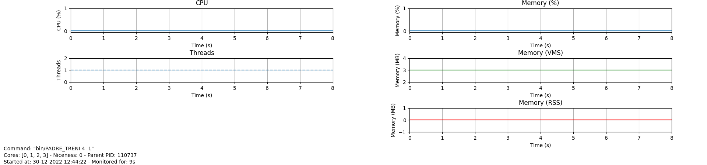
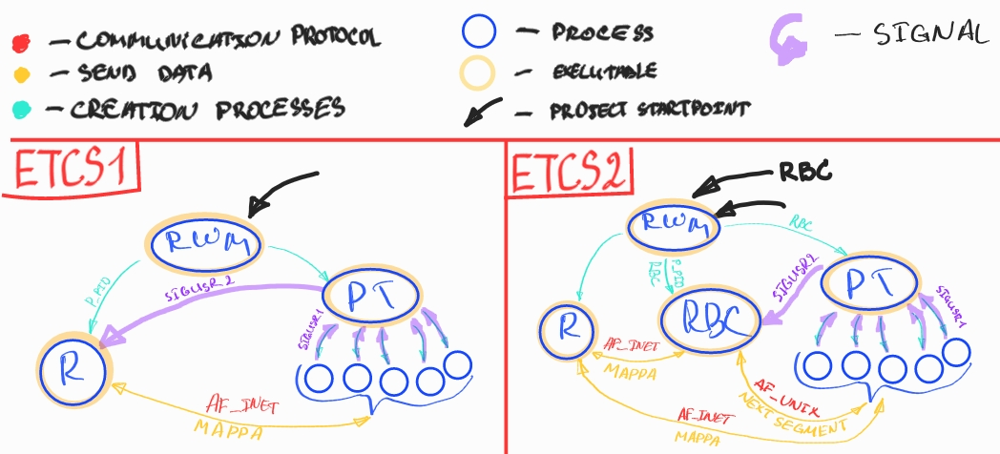
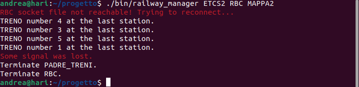
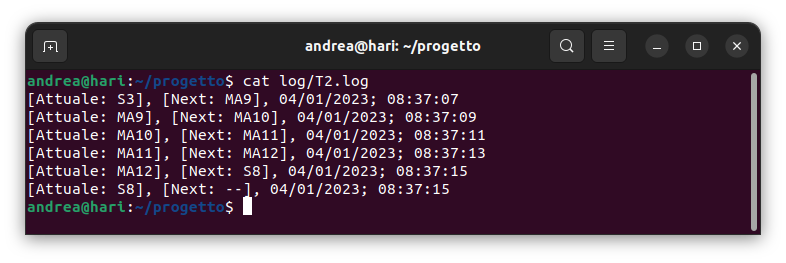
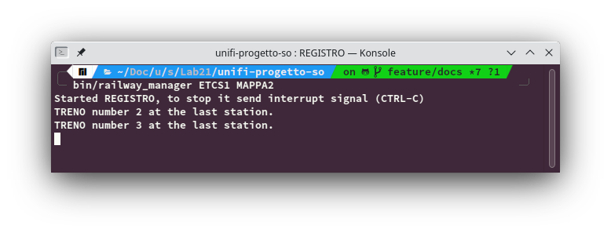
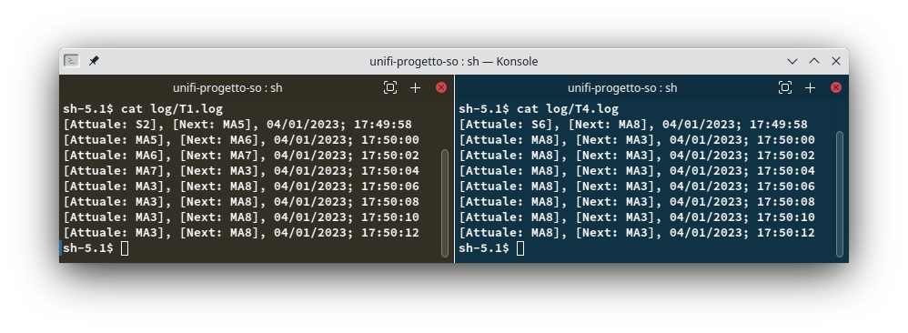

# Progetto di Sistemi Operativi – Anno Accademico 2021/2022

| Nome         | Matricola | Mail                  |
| ------------ | --------- | --------------------- |
| Name Surname | 0000000   | name.surname@best.uni |
| Name Surname | 0000000   | name.surname@best.uni |

> Data di consegna: 00/00/0000

- [Progetto di Sistemi Operativi – Anno Accademico 2021/2022](#progetto-di-sistemi-operativi--anno-accademico-20212022)
    - [Compilazione ed esecuzione](#compilazione-ed-esecuzione)
    - [Sistema obiettivo](#sistema-obiettivo)
      - [Hardware](#hardware)
        - [Architettura](#architettura)
        - [CPU e memoria](#cpu-e-memoria)
      - [Software](#software)
    - [Progettazione e implementazione](#progettazione-e-implementazione)
      - [Caratteristiche comuni](#caratteristiche-comuni)
      - [`railway_manager`](#railway_manager)
      - [`RBC`](#rbc)
        - [`PLATFORM`](#platform)
        - [`RAILWAY`](#railway)
        - [`ITINERARY`](#itinerary)
      - [`PADRE_TRENI`](#padre_treni)
        - [`TRENO`](#treno)
      - [`REGISTRO`](#registro)
      - [`common`](#common)
    - [Elementi facoltativi](#elementi-facoltativi)
    - [Esecuzione](#esecuzione)

### Compilazione ed esecuzione

Per compilare tutto il codice sorgente è necessario digitare il comando make all da shell. Durante la compilazione saranno generate le seguenti cartelle:

- **bin** File binari necessari per l'esecuzione.
- **log** File di log generati dai processi treni e da RBC.
- **obj** File oggetto risultanti dalla compilazione dei sorgenti.
- **tmp** File creati dai processi durante l'esecuzione, necessari per il loro funzionamento.

Digitando soltanto make o make help, si ottiene un messaggio di aiuto che mostra tutti i possibili comandi.


Il programma è eseguibile in modalità ETCS1 e ETCS2. In entrambi i casi è necessario avviare tramite shell il file railway_manager situato nella cartella bin.  
Nella figura sotto è mostrato un esempio di avvio in modalità ETCS1. Eventualmente si può sostituire MAPPA1 con MAPPA2:

```sh
bin/railway_manager ETCS1 MAPPA1
```

L'esecuzione in modalità ETCS2 richiede l'utilizzo di due shell. Si riporta sotto un possibile avvio:

Shell 1:

```sh
bin/railway_manager ETCS2 MAPPA2
```

Shell 2:

```sh
$ bin/railway_manager ETCS2 RBC MAPPA2
```

### Sistema obiettivo

#### Hardware

| Architettura | RAM          | CPU                     |
| ------------ | ------------ | ----------------------- |
| x86_64       | 8 GB         | Intel® Core™ i5-8250U   |
| x86_64       | Ubuntu 22.04 | Linux 5.15.0-56-generic |

##### Architettura

Nonostante il codice sia stato sviluppato su computer montanti architetture **x86_64**, non sono state utilizzate funzionalità specifiche di quest'ultima. Pertanto, è possibile compilare i sorgenti anche su computer che montano architetture diverse, come **arm**, **arm64** o **x86**.

##### CPU e memoria

Caratteristiche computazionali dell'esecuzione di un processo TRENO:



La dimensione dei file di log, potrebbe rappresentare un limite per la memoria secondaria. Effettuando un semplice [profiling](https://github.com/nmaggioni/pmon) di diversi componenti, i risultati ottenuti sono approssimativamente gli stessi e tutti molto bassi. Questo ci permette di non avere vincoli prestazionali, computazionali e di memoria primaria.

Il programma richiede poca memoria (primaria e secondaria) e CPU per essere eseguito. Le prestazioni necessarie sono quelle minime del sistema operativo più qualche MB di memoria primaria. Questo ci permette di usare il programma anche su sistemi embedded.

```
Name:   PADRE_TRENI
Pid:    112875
VmPeak:     3428 kB
VmSize:     3428 kB
VmRSS:       112 kB
VmData:      228 kB
VmStk:       132 kB
VmExe:        12 kB
VmLib:      2036 kB
VmPTE:        40 kB
VmSwap:        0 kB
```

#### Software

| Sistema Operativo | Distribuzione | Kernel                  | File system |
| ----------------- | ------------- | ----------------------- | ----------- |
| GNU/Linux         | Ubuntu 22.04  | Linux 5.15.0-56-generic | EXT4        |
| GNU/Linux         | Ubuntu 22.04  | Linux 5.15.0-56-generic | EXT4        |

Il codice è stato sviluppato aderendo allo standard POSIX e utilizzando
le utility GNU presenti nei sistemi operativi della famiglia GNU/Linux.
Essendo lo standard POSIX e le librerie GNU molto usati in diversi sistemi
operativi, è probabile che sistemi operativi (BSD, MacOS, Solaris etc.) che
rispettano le caratteristiche descritte prima possano soddisfare le
necessità del programma. Cioé, sarà possibile compilare ed eseguire il codice
correttamente anche su suddetti sistemi.

I test sono stati eseguiti nei sistemi operativi presenti nella tabella sopra.

Non sono state usate funzionalità specifiche di un particolare kernel. Di conseguenza, l'utilizzo di un kernel diverso da quelli elencati non dovrebbe influenzare il corretto funzionamento del programma. Similmente, dovrebbe essere indifferente anche la scelta
della distribuzione Linux.

Non avendo usato funzionalità proprie di un file system, non è necessario usarne uno in particolare. Se le richieste del programma in fatto di efficienza aumenteranno, quanto appena detto potrebbe non essere più vero.

### Progettazione e implementazione

<!--  -->



#### Caratteristiche comuni

Il programma è composto da diversi eseguibili che possono essere lanciati separatamente anche senza railway_manager, il quale fornisce tutti i file e argomenti necessari al funzionamento richiesto del programma.

Qua sotto si fornisce una descrizione dei principali componenti.

#### `railway_manager`

Punto di avvio del programma che realizza l'interfaccia richiesta. Inizialmente valida tutti gli argomenti a riga di comando e termina se uno o più di essi non rispetta la sintassi richiesta. In questo caso viene anche mostrato un messaggio con possibili argomenti corretti.Successivamente, crea dei file temporanei richiesti dagli altri eseguibili (`railway.txt` e, a seconda degli argomenti, `MAPPA1` o `MAPPA2`).  
E' opportuno notare che la decisione su quale mappa passare all'eseguibile `REGISTRO` (quindi la decisione riguardo a quale tra le due mappe sarà effettivamente creata e utilizzata) è presa basandosi su un argomento digitato da shell (MAPPA1 o MAPPA2). In modalità ETCS2, `REGISTRO` viene eseguito avviando `railway_manager` senza passare RBC come argomento (si veda il paragrafo [Compilazione ed esecuzione](#compilazione-ed-esecuzione);
la figura è quella dopo la scritta "[Shell1](#etcs2start)").  
Il comportamento differisce leggermente tra le due modalità:

- _**ETCS1**_ `railway_manager` crea `PADRE_TRENI` e viene sostituito da `REGISTRO`.

- _**ETCS2**_ Nell'avvio senza RBC, `railway_manager` viene sostituito da `REGISTRO`. Nell'avvio con RBC, `railway_manager` crea `PADRE_TRENI` e sostituisce sé stesso con `RBC`.

#### `RBC`

Comunica con REGISTRO tramite socket AF_INET e con i processi TRENO tramite socket AF_UNIX. Implementa tre strutture dati: Railway, Itinerary e Platform. Queste aiutano il programma a effettuare i controlli necessari. Termina non appena riceve un segnale SIGUSR2.

##### `PLATFORM`

Implementa una struttura dati Platform e una funzione necessaria per inializzarla dalla stringa passata. Contiene inoltre una funzione per ottenere l'identificatore della piattaforma e una funzione che prende come input la lista degli identificatori. E' usata da Railway e Itinerary.

##### `RAILWAY`

Implementa una struttura dati Railway e una funzione per inizializzarla. Inoltre ha una funzione che controlla se si può accedere a una piattaforma.

##### `ITINERARY`

Implementa una struttura dati Itinerary e una funzione per inizializzarla. Contiene una funzione per liberare una piattaforma e un'altra per chiedere il permesso di accesso a una piattaforma. Per ultimo, una funzione per controllare se si è sull'ultima piattaforma.

#### `PADRE_TRENI`

Si occupa della creazione dei 16 segmenti e dei processi TRENO, nonché dell'esecuzione di questi ultimi. Il numero di processi TRENO creati è deciso da `railway_manager`. Termina quando ha ricevuto un numero sufficiente di segnali SIGUSR1 dai processi TRENO.

##### `TRENO`

Riceve il nome del treno da `PADRE_TRENI`. Si connette a `REGISTRO` tramite socket AF_INET per ricevere l'itinerario da percorrere. Controlla se i segmenti creati da `PADRE_TRENI` sono liberi. Se sì, li occupa. In modalità ETCS2, il permesso di accesso ai vari segmenti è ottenuto da `RBC`, che comunica con i processi `TRENO` tramite socket `AF_UNIX`. Quando raggiunge la stazione di arrivo, invia un segnale SIGUSR1 a `PADRE_TRENI`.

#### `REGISTRO`

Riceve come input un pathname della mappa, che usa per recuperarla e leggerla. Finito di leggere, divide la mappa in itinerari e avvia un server socket AF_INET per inviare questi itinerari ai processi `TRENO` e a `RBC` (a quest'ultimo solo se la modalità è ETCS2).

#### `common`

File che implementano delle funzioni utilizzate in varie parti del programma:

- **log.c** Creazione e scrittura di file di log. Usato da `TRENO` e da `RBC`.
- **parent_dir.c** Contiene una funzione che ritorna il path assoluto di un file.
- **socket.c** Creazione, lettura, scrittura e chiusura di socket lato client e lato server. E' possibile scegliere tra AF_UNIX e AF_INET.
- **string_handlers.c** Varie operazioni per manipolare stringhe.

In aggiunta a quelli elencati sopra, troviamo altri due file:

- **alloc_macro.h** Insieme di macro che aiutano ad allocare la memoria necessaria e a localizzare i relativi controlli in un solo punto, riducendo così la duplicazione del codice.
- **mode.h** enum con due valori: PERMIT e MOVE. Usato da `RBC` e da `TRENO`.

### Elementi facoltativi

| Elemento facoltativo                                                     | Realizzato(SI/NO) | Descrizione metodo o file principale                    |
| ------------------------------------------------------------------------ | ----------------- | ------------------------------------------------------- |
| Implementare soluzioni per gestire letture/scritture concorrenti         | SI                | Funzione di libreria `flock`                            |
| In caso di informazione discordante tra RBC e boe, il TRENO rimane fermo | SI                | Realizzato tramite le strutture `Railway` e `Itinerary` |
| Terminazione di PADRE_TRENI e PROCESSO_TRENO basata sul segnale SIGUSR1  | SI                | Funzione POSIX `sigaction`                              |
| Terminazione di RBC basata sul segnale SIGUSR2                           | SI                | Funzione POSIX `signal`                                 |

### Esecuzione

Sono stati rilevati due casi che meritano una particolare attenzione.  
Per illustrare il primo, lanciamo il programma in modalità ETCS2. Quando lanciamo `railway_manager` con argomento RBC, non preoccupiamoci del
del messaggio "RBC socket file not reachable: trying to reconnect".



Notiamo che sembra mancare all'appello il treno T2. Tuttavia, se ispezioniamo T2.log, vediamo che esso ha raggiunto la stazione di arrivo:



E' accaduto che alcuni segnali SIGUSR1 sono arrivati contemporaneamente a `PADRE_TRENI`, che non è riuscito a elaborarli tutti. Ad ogni modo, `PADRE_TRENI` ci informa che ciò è successo mostrando a schermo il messaggio: "some signal was lost".





Osservando i due screenshot sopra, possiamo vedere che talvolta si verifica uno stallo tra i treni T1 e T4.

Per come è strutturato il programma, i processi `TRENO` possono anche passare da diverse stazioni prima di giungere a quella di arrivo. Facciamo un esempio con un solo treno.  
Per prima cosa, creiamo una mappa MAPPA3 che contiene una stazione intermedia :

```
S2, MA5, MA6, MA7, MA3, MA8, S6, MA8, MA3, MA4, S5
```

Lanciamo gli eseguibili in tre diversi shell (oppure tutti in uno, però separati da `&`. Attenzione `REGISTRO` non si chiude da se) e controlliamo T1.log:

```sh
$ bin/REGISTRO tmp/MAPPA3
$ bin/RBC
$ bin/PADRE_TRENI 1 tmp/rbc
```


